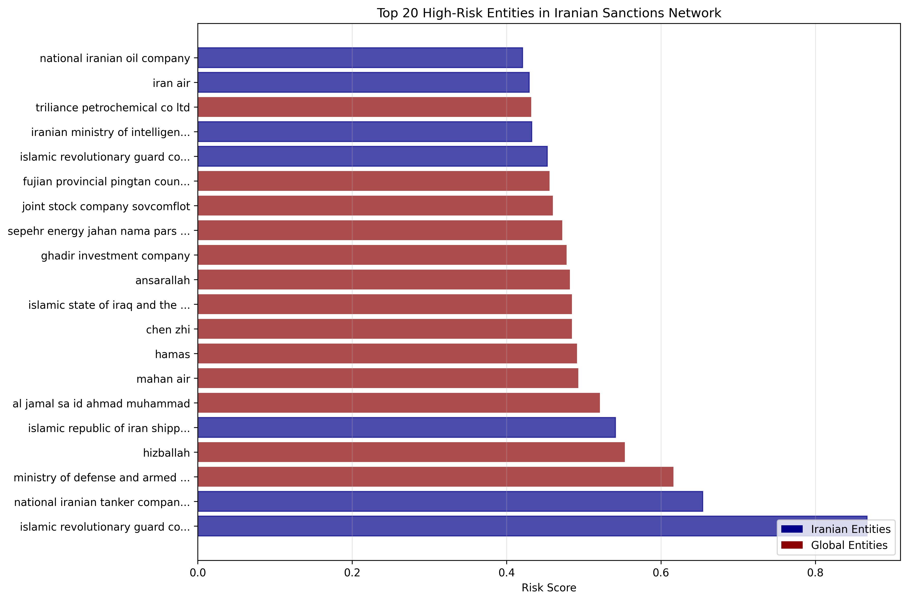
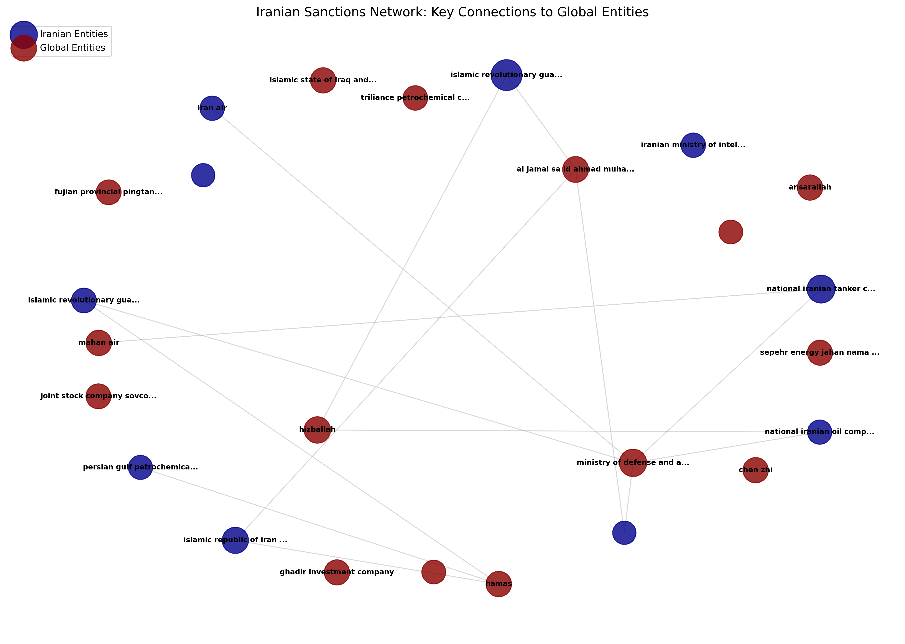
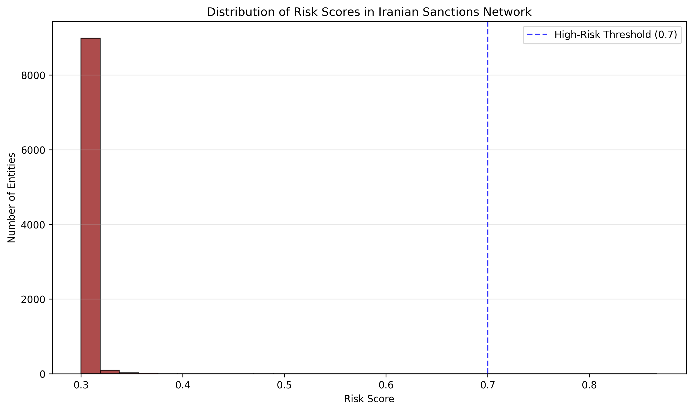

# Sanctions Network Analyzer

A graph-based tool for detecting sanctions evasion, shell-company chains, and
subversive funding networks by cross-referencing corporate registries, OFAC
sanctions lists, and nonprofit databases.

## How It Works

1. **Ingestion** — Pull company officers from OpenCorporates, sanctioned
   entities from OFAC, and Israeli nonprofit financials from Guidestar.
2. **Graph Construction** — Build a directed graph where nodes are companies,
   people, or nonprofits and edges represent ownership, directorship, or
   funding relationships.
3. **Risk Scoring** — Score every node using Betweenness Centrality, PageRank,
   and proximity to sanctioned entities.
4. **Export** — Write the graph to Neo4j for visual investigation with
   Neo4j Bloom / Linkurious, or export to JSON/CSV.

## Detected Patterns

| Pattern | Description |
|---|---|
| Shell Chain | Long chain of companies across jurisdictions masking the origin of funds |
| Fan-In | Many small entities funneling money to a single hub |
| Layering | Nominee directors appearing across dozens of unrelated companies |
| Sanctions Proximity | Entity connected (≤ 2 hops) to an OFAC-listed company |

## Installation

```bash
python -m venv .venv
source .venv/bin/activate   # Windows: .venv\Scripts\activate
pip install -r requirements.txt
```

Copy `.env.example` to `.env` and fill in your credentials.

## Quick Start

```bash
# Analyze a list of target companies
python main.py --targets data/targets.csv --output data/output.json

# Export results to Neo4j
python main.py --targets data/targets.csv --neo4j

# Analyze Iranian sanctioned companies and their global connections
python main.py --targets data/iran_targets.csv --output data/iran_analysis.json
```

## Iranian Sanctions Network Analysis

This project has been used to analyze the network of Iranian sanctioned companies and their connections to global entities. The analysis reveals extensive connections between Iranian financial institutions, defense organizations, and international terrorist groups.

### Key Findings

- **9,161 entities** in the global sanctions network connected to Iranian companies
- **15,788 relationship edges** extracted from OFAC "Linked To" data
- **9,144 high-risk entities** identified

### Major Global Connections

Iranian sanctioned companies show connections to:
- **Hezbollah** (Lebanese militant group)
- **Hamas** (Palestinian militant organization)
- **Islamic State of Iraq and the Levant (ISIS)**
- **Ansarallah** (Houthis - Yemen-based militants)
- Various Chinese and Russian entities

### Visualizations

#### Top High-Risk Entities


*Bar chart showing the top 20 high-risk entities in the Iranian sanctions network. Blue bars represent Iranian entities, red bars represent global connections.*

#### Network Visualization


*Network graph showing connections between Iranian companies (blue) and global entities (red). Node sizes represent risk scores.*

#### Risk Score Distribution


*Histogram showing the distribution of risk scores across all entities in the network. The blue line indicates the high-risk threshold (0.7).*

### Running the Iranian Analysis

```bash
# Generate visualizations
python visualize_results.py

# Analyze all 1,153 Iranian sanctioned companies
python main.py --targets data/iran_targets.csv --output data/full_iran_analysis.json
```

## Data Sources

| Source | What it provides | Access |
|---|---|---|
| [OpenCorporates](https://opencorporates.com) | Company officers, registration data | Free tier / paid API |
| [OFAC SDN List](https://ofac.treasury.gov/specially-designated-nationals-and-blocked-persons-list-sdn-human-readable-lists) | US sanctions targets | Public |
| [Guidestar Israel](https://www.guidestar.org.il) | Israeli nonprofit financials | Public scrape |
| [Aleph / OCCRP](https://aleph.occrp.org) | Leaks, corporate registries, corruption data | Free (rate-limited) |

## Project Structure

```
sanctions-network-analyzer/
├── ingestion/
│   ├── opencorporates.py   # OpenCorporates API client
│   ├── ofac.py             # OFAC SDN list parser
│   └── guidestar.py        # Israeli nonprofit scraper
├── analysis/
│   ├── graph.py            # Graph construction (NetworkX)
│   └── risk_scoring.py     # Centrality + risk metrics
├── export/
│   └── neo4j_export.py     # Neo4j Cypher writer
├── data/
│   ├── targets.csv         # Example input
│   ├── iran_targets.csv    # Iranian sanctioned companies
│   └── iran_100_connections.json  # Analysis results
├── visualizations/
│   ├── top_entities_chart.png     # Top high-risk entities chart
│   ├── network_visualization.png  # Network graph
│   └── risk_distribution.png      # Risk score distribution
├── tests/
├── config.py
├── main.py
├── visualize_results.py    # Visualization generation script
├── requirements.txt
└── .env.example
```
